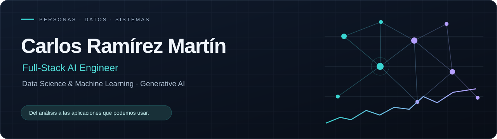
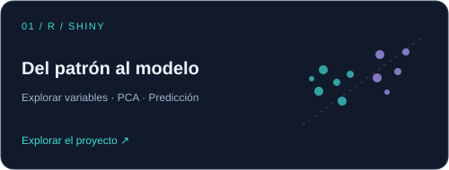
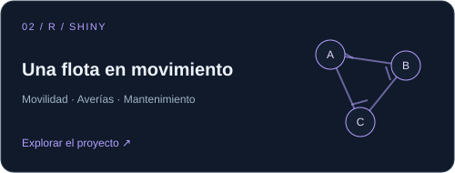
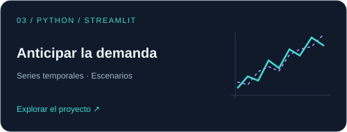
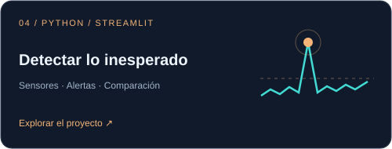

  

  
  
  

## Ciencia de datos con perspectiva de negocio

Soy Carlos Ramírez Martín, **Full-Stack AI Engineer**. Trabajo en la conexión entre datos, modelos y aplicaciones, con una trayectoria que combina análisis de datos, previsión de demanda y gestión de proyectos. Esa experiencia me ha enseñado a empezar por el problema que queremos resolver, no por la herramienta.

Mi enfoque une **ciencia de datos y machine learning** con el desarrollo de aplicaciones basadas en modelos fundacionales. Exploro el **prompt engineering, los sistemas RAG y la IA generativa**, prestando atención a cómo se evalúan los resultados y cómo llegan al usuario.

### 🧰 Datos, desarrollo e IA

  
  
  
  
  
  
  
  
  

## 🚀 Proyectos para explorar

  
  

  
  

**Las cuatro aplicaciones se pueden probar desde [mi portfolio](https://carlos-ramirez-martin.up.railway.app/es/#projects).** Sus repositorios incluyen instrucciones, pruebas y las limitaciones de cada experimento.

También desarrollo [**Respuestas con evidencia**](https://github.com/CharlyCRM/document-rag-lab), un laboratorio RAG local para recuperar documentos, generar respuestas con referencias y revisar la relación entre una respuesta y sus fuentes. Este proyecto no tiene demo pública.

## 🎓 Formación y recorrido

Mi formación combina ciencia de datos en la **UOC**, Big Data y machine learning en **Tokio School**, Python y metodologías ágiles. Las [credenciales de Scrum Manager](https://scrummanager.com/website/c/profile/member.php?id=44965) complementan esa base técnica con una mirada de equipo y gestión.

En GitHub también conservo trabajos académicos y prácticas de Python, Flask, SQLAlchemy y C. Son parte de mi recorrido, diferenciados de los proyectos actuales para que puedas elegir qué revisar.

<strong>Ver proyectos de formación y primeras prácticas</strong>

- [Proyecto final de Big Data](https://github.com/CharlyCRM/Proyecto_Final_Master_Big_Data): análisis de pasajeros con PySpark y documentación de Cassandra.
- [Análisis con Spark](https://github.com/CharlyCRM/Analisis_Datos_Spark): cuadernos de exploración y estadística.
- [Cuadernos de machine learning](https://github.com/CharlyCRM/Kaggle_Competitions): ejercicios de vivienda y Titanic.
- [Prácticas de Python](https://github.com/CharlyCRM/ejercicios_practica) y [fundamentos de C](https://github.com/CharlyCRM/42Barcelona).

---

### 🤝 Hablemos

Si quieres conocer mi trabajo o conversar sobre datos e IA, puedes encontrarme en [LinkedIn](https://www.linkedin.com/in/carlosramirezmartin/) o escribirme a **[charlycrm@hotmail.com](mailto:charlycrm@hotmail.com)**.
